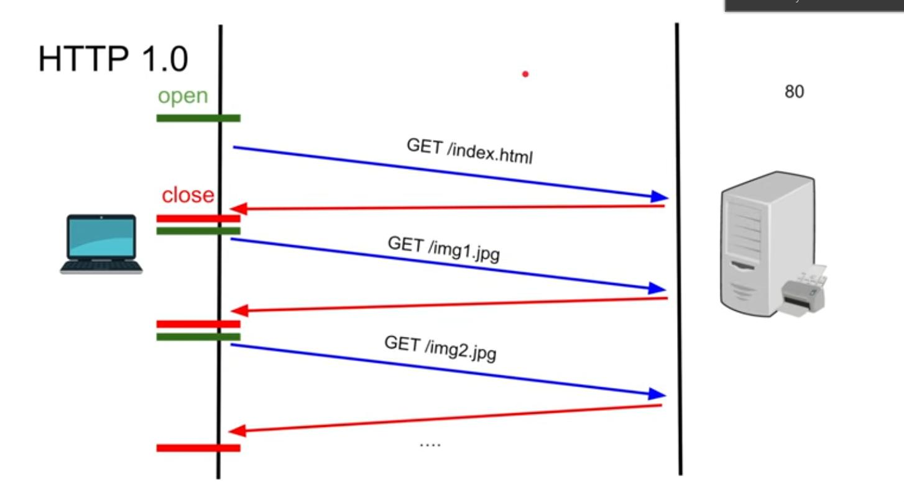
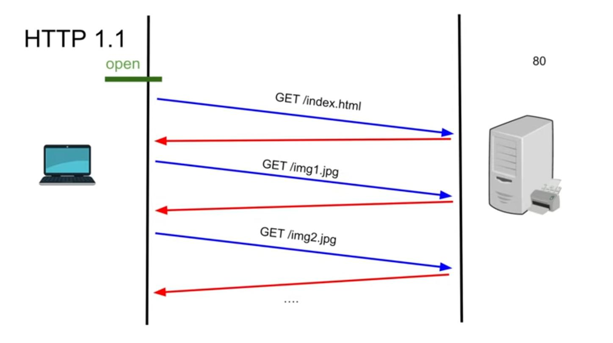

# HTTP

Request body
- URL
- Method type
- Headers
- Body

Response body
- Status code
- Headers
- Body

# Versions of HTTP

## HTTP v1.0

- TCP connection is closed after completing request.
- Buffers for large index.html
- Survived 1 year

## HTTP v1.1

- invented the "Keep Alive" header sent by client to server.
- Etags was introduced.
- Persisted TCP Connection
- Streaming with chucked transfer instead of buffering
- Pipeling can be used, requests can be sent parrallely, leads to ordering issue. (not used generally)

## HTTP v2.0

- Multiplexing (multiple req/res sent simultaneously over single TCP connection)
- This resolved the "head-of-line" blocking issue (1st item stalls all subsequents items)
- Binary format is used
- Protocol negotiation during TLS

### HPACK

- Headers are compressed using HPACK.
- It works by having
    1. Static dictionary of 61 commonly used headers
    2. Dynamic dictionary, list of headers encountered during connection
    3. Huffman code

- dictionaries map headers (name:value or name or value) to bytes
- In subsequent requests, headers like cookie or referer are taken from dynamic dictionary
- Works againsts CRIME attacks (Manipulate requests & check resulting compressed payload size)

### Server Push

- Server proactively sends assets (JS, CSS, etc) to client's cache before the requests
- Deprecated in favor of 103 Early Hints

## HTTP v3.0

- Replace TCP with QUIC
- QUIC is UDP with congestion control
