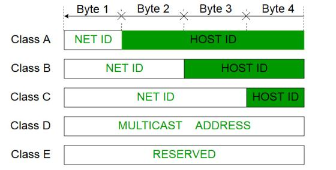

# Network Layer

- objective is the best effort deliverly of packets to a destination.
- Datalink layer only delivers data to next hop.
- hence networks layers comes since there are multiple hops.

### Services Provided

1. Addressing
    - uniquely identify network and hosts in a network
1. Datagram Delivery
1. Routing
    - find optimal path in a decentralised network
    - may not shortest path

## Addressing

### Classfull Addressing

this is old format, not used anymore.  
format

- 32 bits in size.
- fixed number of bits for network and host address.



Multicast Address

- identify a group of hosts
- used for one to many communications

Network Address

- identify a network
- all 0's in host address part

Broadcast Address

- sends data to all hosts in a network
- all 1's in host address part

Problem with classfull addressing

- to support 255 hosts, we have to use a class B address
- much address space is wasted

### CIDR (Classless Inter Domain Routing)

terms

1. Subnetting, divide large network into smaller ones   
1. Supernetting, combine small networks into a larger one   
1. Supernet Mask, 32 bit number logically AND with IP to get subnet.   

format of address is 

```
191.180.83.235/12
subnet mask will be 255.240.0.0 (12 1's)
```


__NOTE__: avoid all 1's and all 0's subnets

networks are divided into sub nets.
subnet mark length can be variable, even when dividing.

### Network Address Translation

issues

- address space is limited
- large number of address are wasted

solutions, it to make address reusable

- private address are reusable
- public address are not reusable
- NAT Device temporarily maps pirvate address to public address.

Other benefits of NAT Device,

1. IP Masquerading
    - mapping one public address to many hosts
    - by adding ports numbers
1. Load Balancing

### IPv6 

problems with IPv4

- mobility support was not present
- connectivity was the only requirement
- not meant from mutimedia transfer.

features

1. larger address space
1. Globally unqiue addressing
1. Routing optimising by using prefixes
1. Auto configuration for network interfaces
1. backwards compatibility with IPv4
