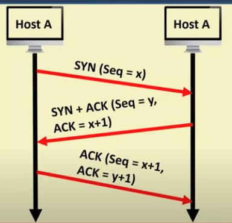
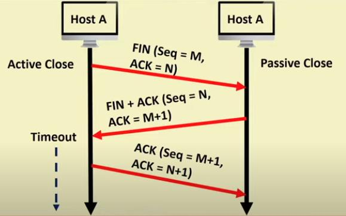

# Transmission Control Protocol

most popular implementation for transport layer

## Connection Managements

- uses 32 bit sequence number
- uses Three way handshake
- TCP prevents receiving data before the handshake.

### Connection establishment

old implementation used,

- seq no cycles in [0, 2 ^ 32 - 1] every 4 microsecound.
- can result in `SYN Flood Attack`, brute force guessing seq no.
- a type of denial of service attack by sending lots of SYNs.

new versions use a cryptographic function instead.

`ACK` is the seq no, it expects in the next message.

### Connection release

Active closer enters the last Timeout after final ACK to ensure delayed packets are discarded.

### Keep Alive Mechanism

- used to maintain open connection even when their is no data transmission.
- by sending periodic `keep-alive` packets

When does it happen?

- no data has to be send
- server advertises receiver window size of 0, due to lack of space.

