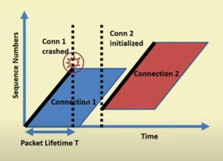
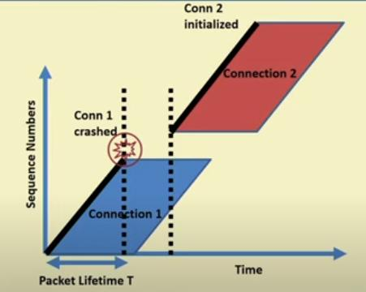

# Transport Layer

- ensures end to end communication
- implemented by the kernel

### Services Provided

- Network layer provides only Datagram delivery (unreliable)
- unlike TCP, UDP doesnot provide below services

1. Connection Establistment
1. Reliable Data Delivery
    - network layer can drop packets
    - ensuring delivery, even if packets are dropped
1. Flow control
    - agreed upon rate of delivery (flow control)
    - faster device doesn't overwhelm slower device
1. Congestion control
    - avoids congestion on junctions
1. Ordered Packet delivery

## Delayed Duplicated Delivery

- to ensure reliability, packets are resend after a timeout
- differentiating between such packets is different
- machine can also crash after initiating connection request

### Solutions

1. using throwaway port numbers (transport address)
    - changing port number after program crashes
    - port number are limited
1. assigning unique identifier choosen by client
    - how to ensure its unique globally
1. each packet has a lifetime
    - we kill of aged packets
    - putting a hop count in each packet
    - timestamping in each packet, requires time synchronization (hard)

### Acknowledgement Problem

- when a packet dies, we need to ensure, all acknowledgements of it are also dead
- problem it prevents
    - client sends req 1
    - client restarts due to crash
    - client sends req 2
    - client receives res 1
    - how will client know res 1 is for req 1 or req 2

### Solution

- Maximum packet lifetime, `T`
    - time after packet is send when its completely dead
    - packet and its anknowledgments
- Choosing a Sequence Number
    - label segment with a sequence number
    - that no is not resued for T.
    - ensures that at any time there is only one packet with unique no.
    - size is determined by T and rate of packets per secound.
- Properties of Sequence Number
    - a seq no does not refer to more than one byte
    - valid range of sequence numbers must be synchronized

```
| seq no | len | payload |
if len is 100, payload length has 100 bytes
seq no is ex: 500, means 500 - 600 bytes are present here
```

### deciding initial sequence no

- problem of crashing


- 2 solutions
- wait for packets to die off completely



- choose a different higher seq no



- here the range between two connections is `forbidden range`
